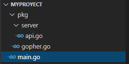

# Tutorial GO

Go, también conocido como Golang o Google Go,es un lenguaje de programación concurrente, compilado de código abierto (open source) relativamente nuevo ya que data de once años de antigüedad hablando históricamente, donde su trayectoria ha permitido ir mejorando, puliendo y madurando todos sus detalles. Se encuentra inspirado en la sintaxis de lenguaje C y Algol, con tipado estático

## Instalación de Golang
Lo primero que hay que hacer es instalar go para ello: 
 -Iremos a su página principal https://golang.org/ . 
 -Tocar el botón de descargar. 
 -Elegimos en qué sistemas queremos descargarlo. 

también necesitaremos un editor de texto yo recomiendo visual code y es el que voy a utilizar para realizar este tutorial.

## Rest Api

Para poder entender un poco más de Go vamos a realizar una Rest Api.

Lo primero que vamos a hacer es realizar la arquitectura de nuestro proyecto.

  

Dentro del myproyecto/main.go es donde daremos arranque a nuestra aplicación.

Dentro de de la carpeta pkg es donde pondré el resto del código, en algunos proyectos todo el código se encuentra en el directorio raíz, esto puede ocurrir porque es un proyecto pequeño.

dentro de pkg/server encontraremos todo lo necesario para que funcione nuestro server HTTP

## comencemos 
 
lo primero que vamos a hacer es arrancar nuestro servidor HTTP

<pre><code>
    package main
 
    import (
    "fmt"
    "log"
    "net/http" 
    )
 
    func main() {
        
    log.Fatal(http.ListenAndServe(":8080", nil))
    fmt.Println("Server abierto en http://localhost:8080")
 
    }
</code></pre>

Una vez echo esto ya podremos correr nuestro servidor, pero como no tiene nada si entramos al localhost:8080 no se encuentra nada

### Router de Gorilla
para realizar esta Rest Api vamos a utilizar una librereria llamada Gorrila mux, se pueden realizar los endpoint si esta libreria pero asi es mas simple

para agregar la libreria simplemente ejecutamos el siguiente codigo

<pre><code>
$ go get -u github.com/gorilla/mux
</code></pre>

Una vez que tenemos esta libreria vamos a escribir en nuestro fichero server dentro de api.go

<pre><code>
package server

import "github.com/gorilla/mux"

type api struct {
	router http.Handler
}

type Server interface {
	Router() http.Handler
}

func New() Server {
	a := &api{}

	r := mux.NewRouter()
	a.router = r
	return a
}

func (a *api) Router() http.Handler {
	return a.router
}
</code></pre>

una vez ya tenemos preparado nuestro servidor HTTP lo que tenemos que hacer es modificar nuestro archivo main.go

<pre><code>
package main

import (
	"fmt"
	"log"
	"net/http"

	"./pkg/server"
)

func main() {
	s := server.New()

	fmt.Println("Server abierto en http://localhost:8080")

	log.Fatal(http.ListenAndServe(":8080", s.Router()))

}
</code></pre>

Hasta ahora hemos crado nuestro router pero no hemos agregado endpints en el mismo y para eso se utiliza Gorilla mux que nos permite gestionarlas de forma sencilla.

### Agregemos nuestro endpoint

vamos a crear los siguientes endpoints: 

-GET /gophers | Devuelve todos los gophers  
-GET /gophers/{gopher_id} | Devuelve los datos del gopher seleccionado  

### Creamos las rutas

para esto vamos a nuestro fichero server y modificamos el archivo api.go

<per><code>
package server

import (
	"net/http"

	gopher "github.com/mateocarranza/Rest_Api/src/Myproyect/pkg"

	"github.com/gorilla/mux"
)

type api struct {
	router http.Handler
}

//Server es la interface nuestro server
type Server interface {
	Router() http.Handler
}

//New Server cre un servidor nuevo y lo retorna
func New() Server {
	a := &api{}

	r := mux.NewRouter()
	r.HandleFunc("/people", gopher.GetPeopleEndpoint).Methods("Get")
	r.HandleFunc("/people/{id}", gopher.GetPersonEndpoint).Methods("Get")

	a.router = r

	return a
}

func (a *api) Router() http.Handler {

	return a.router
}

</code></per>

si ejecuta esto nos dira que no encuentra la funcion GetPeopleEndpoint ni GetPersonEndpoint, porque no hemos creado nuestra funciones.

### Creamos nuestras funciones 

vamos al fichero 

<per><code>
func (a *api) fetchGophers(w http.ResponseWriter, r *http.Request) {}
func (a *api) fetchGopher(w http.ResponseWriter, r *http.Request) {}
</code></per>

pero antes de completar nuestras funciones vamos a relalizar la estructura de  nuestro gophers o personas dentro de nuestro gopher.go

<per><code>
//Person es la estructura de la informacion que va a tener la persona
type Person struct {
	ID        string   `json:"id,omitempty"`
	FirstName string   `json:"firstname,omitempty"`
	LastName  string   `json:"lastname,omitempty"`
	Address   *Address `json:"address,omitempty"`
}

//Address es la estructura de la informacion de la direccion
type Address struct {
	City  string `json:"city,omitempty"`
	State string `json:"state,omitempty"`
}

</code></per>

struct es una colección de múltiples campos de datos con sus tipos de datos definidos agrupados. Son útiles para agrupar datos para formar registros personalizados.

Ahora si les damos forma a nuestras funciones en nuestro gopher.go

<per><code>
//GetPeopleEndpoint devuelve al servidor toda la informacion de las personas
func GetPeopleEndpoint(a http.ResponseWriter, request *http.Request) {
	json.NewEncoder(a).Encode(People)
}

//GetPersonEndpoint devuelve la informacion de una persona pedida por el servidor
func GetPersonEndpoint(a http.ResponseWriter, request *http.Request) {
	params := mux.Vars(request)
	for _, item := range People {
		if item.ID == params["id"] {
			json.NewEncoder(a).Encode(item)
			return
		}
	}
	json.NewEncoder(a).Encode(&Person{})

}
</code></per>

Ya casi terminamos solo nos falta algunos arregla, lo primero que vamos a hacer es agregar un array y una funcion para poder agregar gopher a nuestro archivo gopher.go para que quede de la sigueinte forma.

<per><code>
package gopher

import (
	"encoding/json"
	"net/http"

	"github.com/gorilla/mux"
)

//Person es la estructura de la informacion que va a tener la persona
type Person struct {
	ID        string   `json:"id,omitempty"`
	FirstName string   `json:"firstname,omitempty"`
	LastName  string   `json:"lastname,omitempty"`
	Address   *Address `json:"address,omitempty"`
}

//Address es la estructura de la informacion de la direccion
type Address struct {
	City  string `json:"city,omitempty"`
	State string `json:"state,omitempty"`
}

//People contiene todas las personas en json
var People []Person

//SetPeople guarda una nueva personas
func SetPeople(id string, name string, lastname string, city string, state string) {
	People = append(People, Person{ID: id, FirstName: name, LastName: lastname, Address: &Address{City: city, State: state}})
}

//GetPeopleEndpoint devuelve al servidor toda la informacion de las personas
func GetPeopleEndpoint(a http.ResponseWriter, request *http.Request) {
	json.NewEncoder(a).Encode(People)
}

//GetPersonEndpoint devuelve la informacion de una persona pedida por el servidor
func GetPersonEndpoint(a http.ResponseWriter, request *http.Request) {
	params := mux.Vars(request)
	for _, item := range People {
		if item.ID == params["id"] {
			json.NewEncoder(a).Encode(item)
			return
		}
	}
	json.NewEncoder(a).Encode(&Person{})

}
</code></per>

Y ahora debemos importa este archivo a nuestro archivo api.go dentro de server para que funcione y para esto vamos a bajar nuestro archivo que se encuentra en github igual que hicimos con gorilla mux y esto seria de la siguiente forma

<per><code>
go get -u github.com/mateocarranza/Rest_Api/src/Myproyect/pkg
</code></per>

este archivo se encuentra en mi github y de ahi lo estoy guardando en mi  directorio raiz de go, ahora si importamos y nuestro archivo api.go quedaria de la siguiente forma

<per><code>
package server

import (
	"net/http"

	gopher "github.com/mateocarranza/Rest_Api/src/Myproyect/pkg"

	"github.com/gorilla/mux"
)

type api struct {
	router http.Handler
}

//Server es la interface nuestro server
type Server interface {
	Router() http.Handler
}

//New Server cre un servidor nuevo y lo retorna
func New() Server {
	a := &api{}

	r := mux.NewRouter()
	r.HandleFunc("/people", gopher.GetPeopleEndpoint).Methods("Get")
	r.HandleFunc("/people/{id}", gopher.GetPersonEndpoint).Methods("Get")

	a.router = r

	return a
}

func (a *api) Router() http.Handler {

	return a.router
}

</code></per>

Pero todavia no tenemos gopher guardados por lo tanto cuando el servidor busque en las rutas no va a encontrar nada por lo que dentro de main.go para eso tambien tenemos que importar el archivo gopher.go asi utilizamos la funcion que creamos SetPeople por lo que el archivo main quedaria de la siguiente manera.

<per><code>
package main

import (
	"fmt"
	"log"
	"net/http"

	gopher "github.com/mateocarranza/Rest_Api/src/Myproyect/pkg"

	"./pkg/server"
)

func main() {
	s := server.New()

	gopher.SetPeople("1", "mateo", "carranza", "cordoba", "cordoba")

	fmt.Println("Server abierto en http://localhost:8080")

	log.Fatal(http.ListenAndServe(":8080", s.Router()))

}

</code></per>

### Corramos nuestra api

ahora si corremos nuestro archivo Go con 

<per><code>
go run Myproyecto/main.go

</code></per>